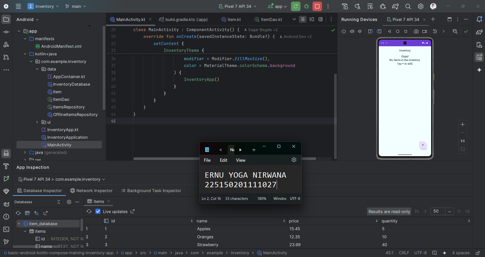

Penjelasan Akhir
----------------

Setelah mengikuti langkah-langkah yang ada pada code-lab, aplikasi dapat dijalankan dengan baik.
Kemudian menambahkan beberapa data dalam database dan mengecek hasilnya pada tabel items.
Untuk mengecek apakah penambahan datanya berhasil atau tidak, dapat membuka tab App Inspection yang ada pada Android Studio.

Seperti yang dilihat pada gambar diatas, sudah terdapat 3 data yang baru saja ditambahkan.
Hal ini menandakan bahwa Room Database sudah berhasil diimplementasikan.